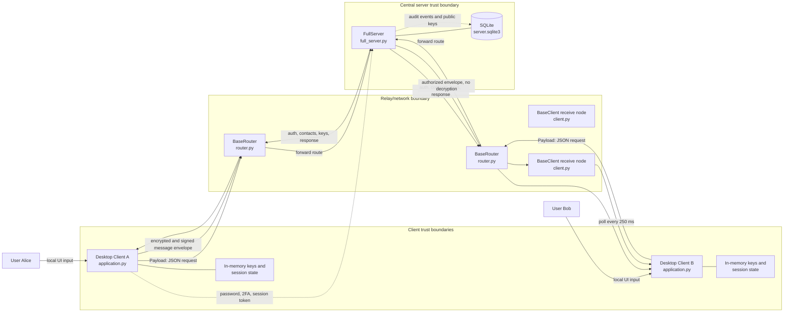

```mermaid
flowchart LR
        userA[User Alice] -->|local UI input| clientA[Desktop Client A\napplication.py]
        userB[User Bob] -->|local UI input| clientB[Desktop Client B\napplication.py]

        subgraph ClientTrust[Client trust boundaries]
                clientA
                clientB
                keysA[In-memory keys and\nsession state]
                keysB[In-memory keys and\nsession state]
                clientA --- keysA
                clientB --- keysB
        end

        subgraph RelayBoundary[Relay/network boundary]
                routerA[BaseRouter\nrouter.py]
                routerB[BaseRouter\nrouter.py]
                nodeA[BaseClient receive node\nclient.py]
                nodeB[BaseClient receive node\nclient.py]
        end

        subgraph ServerTrust[Central server trust boundary]
                server[FullServer\nfull_server.py]
                db[(SQLite\nserver.sqlite3)]
                server --- db
        end

        clientA -->|Payload: JSON request| routerA
        routerA -->|forward route| server
        server -->|auth, contacts, keys, response| routerA
        routerA --> clientA

        clientB -->|Payload: JSON request| routerB
        routerB -->|forward route| server
        server -->|auth, contacts, keys, response| routerB
        routerB --> clientB

        clientA -->|encrypted and signed message envelope| routerA
        server -->|authorized envelope, no decryption| routerB
        routerB --> nodeB
        nodeB -->|poll every 250 ms| clientB

        clientA -.->|password, 2FA, session token| server
        server -.->|audit events and public keys| db
```