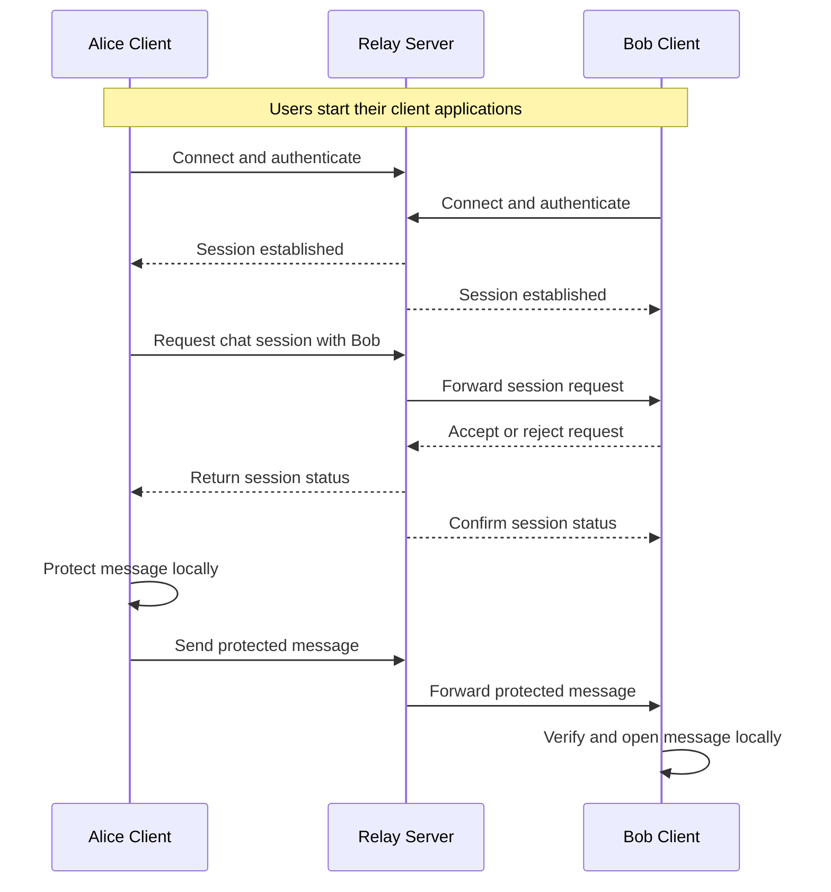

# Project Proposal
## CSCI 4531/6531 — Milestone 1

**Team Members:**
| Name | GWID | Email | Role |
|---|---|---|---|
| First Last | G12345678 | name@gwu.edu | Security Architect |
| First Last | G12345679 | name@gwu.edu | Security Engineer |

**Application:** #4 Encrypted Messenger

---

## Section 1 — Product Description

*Describe your application as if writing a one-page brief for a new teammate. Answer:*
*• What does it do, and who uses it?*
*• Which security properties will you implement, and how specifically?*

Encrypted Messenger is a web or CLI application for private one-to-one chat over an untrusted network. Users create accounts, authenticate, verify contact keys, and exchange messages through a relay. The relay forwards ciphertext and delivery metadata but cannot decrypt message content.

The application provides end-to-end confidentiality and integrity with XChaCha20-Poly1305. Each account also has an RSA identity key for contact-key verification. Passwords are stored as Argon2 hashes with unique salts, and client-relay traffic uses TLS 1.3. An administrator is also a registered user with an added privilege to monitor account and service status, but cannot see users' contacts, conversation existence, or message content.

---

## Section 2 — Timeline

*Week-by-week plan from Oct 2 (proposal) to Nov 20 (final submission).*
*Account for HW3 (due Oct 30) and HW4 (due Dec 5) competing for your time.*

| Week | Dates | Planned Work | Owner (role) |
|---|---|---|---|
| 1 | Oct 2–9 | Submit proposal; scaffold the client, relay, account store, and threat model. | Security Architect |
| 2 | Oct 9–16 | Implement account registration, Argon2 password hashing, TLS login, sessions, and the chat interface. | Security Engineer |
| 3 | Oct 16–23 | Implement client-side XChaCha20-Poly1305 encryption and integrity checks; demonstrate a working two-user chat for Milestone 2. | Engineer + Architect |
| 4 | Oct 23–30 | Add RSA contact-key verification, conversation authorization, rate limiting, and negative tests; complete HW3 due Oct 30. | All |
| 5 | Oct 30–Nov 6 | Complete ciphertext relay and delivery handling; add logout, token revocation, and initial security audit. | Security Engineer |
| 6 | Nov 6–13 | Test tampering, replay, and unauthorized access; apply fixes and complete the report draft. Reserve time for HW4. | All |
| 7 | Nov 13–20 | Complete final integration, security review, documentation, and submission. Continue HW4 work for Dec 5. | All |

---

## Section 3 — Design Plan and Mockups

*Include visual mockups of the key screens. These may be created with AI tools,*
*Figma, hand-drawn sketches, or any other method. Label each and explain what*
*the user is doing and what security mechanism is in play.*

### Mockup 1 — Chat Screen

```text
+--------------------------------------------------+
| Encrypted Messenger       Alice       [Log out]  |
| Contacts: Bob, Carol                             |
+--------------------------------------------------+
| Bob: Are we still on?                            |
| You: Yes, securely.                              |
|                                                  |
| [Type a message...]                 [Send]       |
+--------------------------------------------------+
```

**User action:** Select a verified contact, read messages, and send a message.
**Security mechanism:** The client encrypts and authenticates messages locally; the relay receives ciphertext only.

### Mockup 2 — Login / Account Creation

```text
+--------------------------------------------------+
|               Encrypted Messenger                |
|         Username: [____________________]         |
|         Password: [____________________]         |
|                                                  |
|       [Create account]       [Sign in]           |
+--------------------------------------------------+
```

**User action:** Create an account or start a session.
**Security mechanism:** Credentials use TLS in transit; the server stores only salted Argon2id hashes and issues revocable sessions.

### Mockup 3 — Administrator User View

```text
+--------------------------------------------------+
| Administrative Dashboard                         |
| Server Status: Healthy      Registered users: 12 |
|                                                  |
| User       Account status       Action           |
| Alice      Active               Timeout \ Ban    |
| Bob        Active               Timeout \ Ban    |
|                                                  |
| [Audit log]                                      |
+--------------------------------------------------+
```

**User action:** Use the normal chat account while monitoring registered-user and service status.
**Security mechanism:** A separate monitoring privilege exposes only account and security events; contacts, conversation existence, metadata, and plaintext remain hidden.

### Architecture Diagram



The clients authenticate, request and approve chat sessions, then exchange protected messages through the relay. Protection, verification, and plaintext display occur on client devices. The relay forwards messages without reading their contents.

---

## Section 4 — Security Design

### Security Constraints

*What must your system always guarantee? State these as invariants.*

1. Message plaintext is never stored by the relay or written to server logs.
1. A message is displayed only after XChaCha20-Poly1305 integrity verification succeeds.
1. Passwords use salted Argon2id hashes; failed logins are rate-limited.
1. Private identity keys remain on user devices; key changes require re-verification.

### Threat Model

**Assets:**
* Message plaintext and end-to-end encryption keys
* Passwords, identity private keys, and session tokens
* Contact-key bindings and conversation privacy
* Service availability and privacy reputation

**Adversaries:**
* External network attacker who can observe or modify traffic
* Malicious account holder attempting unauthorized access or impersonation
* Admin user or attacker with database read access attempting to infer contacts
* Compromised dependency or endpoint; fully compromised endpoints are out of scope

**Threats (at least 3):**

| # | Threat | Design Response |
|---|---|---|
| 1 | An attacker who can observe network traffic could read messages or steal credentials. | Use TLS 1.3 and end-to-end XChaCha20-Poly1305 encryption; use Secure, HttpOnly, SameSite cookies for web sessions. |
| 2 | An attacker who can read the database could extract messages, credentials, or contact relationships. | Store ciphertext only; hash passwords with Argon2 and unique salts; keep private keys on clients; minimize and protect relationship metadata. |
| 3 | An attacker who can replace a contact's public key could impersonate that contact. | Use Ed25519 identity keys, display fingerprints, warn on key changes, and require explicit re-verification. |
| 4 | A malicious user who can call another user's API endpoint could access private conversations. | Enforce object-level authorization on every endpoint and test horizontal privilege escalation. |
| 5 | An admin user who can view monitoring data could infer which users are contacting each other. | Expose only registration, account-status, and security events; hide contacts, conversation existence, participants, timing relationships, delivery metadata, and message content. |

### Agentic Coding Plan

**Tools we plan to use:**
* GitHub Copilot for bounded implementation help, test scaffolding, documentation, and mockups
* Official documentation for cryptography, TLS, authentication, and networking libraries

**Division of work:**
* AI may generate UI, API boilerplate, serialization, fixtures, and draft tests.
* Team members will manually define the threat model, key lifecycle, authorization rules, and security-critical code.

**Verification approach for AI-generated security code:**
* Review password, token, and key-handling code against OWASP ASVS and library documentation.
* Test modified ciphertext, wrong keys, replay, expired sessions, malformed requests, and unauthorized access.
* Inspect logs/database contents for plaintext and run static-analysis and dependency checks before submission.
